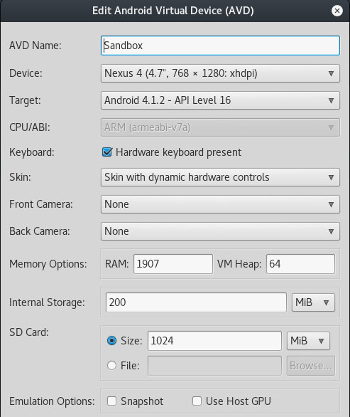
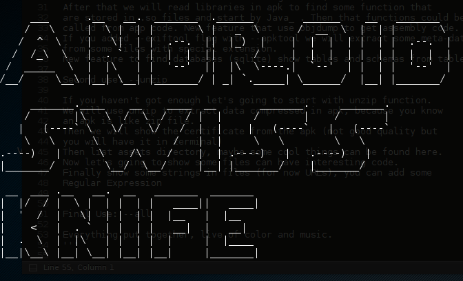
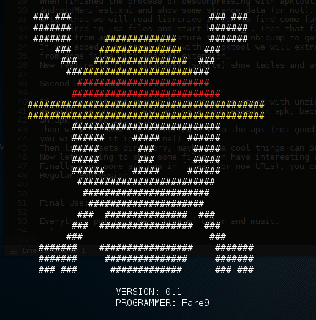

# AndroidSwissKnife

<p>
FrameWork to make <em>static and dynamic analysis</em> for Android APKs in Python
</p>
<p>
If you want to ask me for changes you want to add (for example in AndroidManifest analysis),
write to my email address: farenain9@gmail.com
</p>

<p> Please install this version from github: <a href="https://github.com/Fare9/AndroidSwissKnife/releases/download/v1.0/AndroidSwissKnife.zip">AndroidSwissKnife</a>.
</p>


<p> <h3> New argument parser !!! </h3> </p>
```python
    parser = argparse.ArgumentParser(description="AndroidSwissKnife application to help in apk analysis")
    parser.add_argument("--install",action="store_true",help="To install some necessary tools")
    parser.add_argument("-a","--apk",type=str,help="apk file in your directory or absolute path")
    parser.add_argument("-o","--output",type=str,help="Name for output directories")
    parser.add_argument("--apktool",action="store_true",help="use apktool in Analysis")
    parser.add_argument("--unzip",action="store_true",help="use unzip in Analysis")
    parser.add_argument("--regEx",type=str,help='with unzip function we use a strings searching, you can add a regular Expression (by default URLs and Java Classes)')
    parser.add_argument("--exiftool",action="store_true",help="use exiftool with some file formats (you need first --apktool)")
    parser.add_argument("--jadx",action="store_true",help="use jadx to try to get source code")
    parser.add_argument("--opcodes",action="store_true",help="Get information from opcodes")
    parser.add_argument("--get-jar",action="store_true",help="Get jar from apk and finally the .class in a folder")
    parser.add_argument("--connect",type=str,help="Connect to android device with adb <IP:PORT>")
    parser.add_argument("--all",action="store_true",help="use all Analysis")
    parser.add_argument("--create-apk",action="store_true",help="generate an apk, from apktool folder")
    parser.add_argument("--man",action="store_true",help="Get all the help from the program as star wars film")
    parser.add_argument("--DroidBox",action="store_true",help="New feature to do a dynamic analysis of the apk (It's a \"wrapper\" of droidbox with Burpsuite)")
    parser.add_argument("--Koodous",action="store_true",help="Try to search your apk in Koodous, it will take some time")
    parser.add_argument("--upload",action="store_true",help="If APK is not in koodous upload to analysis")
    parser.add_argument("-f","--folder",type=str,help='folder from apktool (needs --create-apk)')
    parser.add_argument("--apk-output",type=str,help='Output apk (needs --create-apk)')
    args = parser.parse_args()
```

```python
totalHelp = '''
All help is here...

First use: --apktool

We will use apktool to extract data compressed in your apk, please install
the last version of apktool.
When finished the process of descompressing with apktool, we will read the
AndroidManifest.xml and show some strange data (or not).
After that we will read libraries in apk to find some function that
are stored in .so files and start by Java_ . Then that functions could be
called from app code. New feature that use objdump to get assembly code.
If you added --exiftool flag with --apktool we will extract some meta-data
from some files with special extension.
New feature to find databases (sqlite) show tables and schemas from tables.

Second use: --unzip

If you haven't got enough let's going to start with unzip function.
We will use unzip to extract data compressed in apk, because you know
an apk is like zip file.
Then we will show the certificate from the apk (not good quality but
you will have it in terminal)
Then list assets directory, maybe some cool things can be found here.
Now let's going to show some files can have interesting code.
Finally show some strings in files (for now URLs), you can add some
Regular Expression

Third use: --jadx

If you want to try to get java code, we will use jadx to get it. 
It's not better than smali, but If it works you will have source code

Fourth use: --opcodes

Get all instructions, operands used in classes and methods in the bytecode in opcode-name.txt
Get headers of classes and methods in summary-name.txt
Get aditional information about headers like classes' id and superclasses... in sumaryDetails-name.txt
Get the receivers from code that are in AndroidManifest and not. (ORIGINAL IDEA: https://github.com/AndroidWordMalware/malware-samples/blob/master/tools/receiversFinder.py)

Fifth use: --get-jar

Get jar from apk with dex2jar, then get a folder with the jar file
unzipped, you can create java file to call or test classes from this 
jar file.


Final Use: --all

Everything put together, live of color and music.

###### NEW FEATURES ########
--create-apk
Once you have used apktool to get smali code from an apk, you can modify it, and finally
create another apk with your changes, you can use this feature to do it.

### FINALLY DYNAMIC ANALYSIS (DroidBox Wrapper)
--DroidBox (Original Idea https://github.com/pjlantz/droidbox/tree/master/droidbox4.1.1)
I modified DroidBox code to this framework, I rewrite some functions to work in python3
but nothing change from this program. You need to have an android emulator, in Readme.md
you can see the features of my emulator.


### Koodous extension ###
--Koodous
Try to quick analyze your apk with koodous the antivirus from community.
https://koodous.com
If exists the apk, you will get quick analysis

--upload
If you want to upload your APK to Koodous to analyze.
'''
```

<h3>Features for android Emulator</h3>

<p></p>
<p></p>


<p></p>

<p></p>


<h3>Next Release</h3>
<p> For the next release, I will upload an Androidx86 6.0, virtual machine for Dynamic Analysis with Xposed and Droidmon </p> 

Follow the straw hat Pirates
